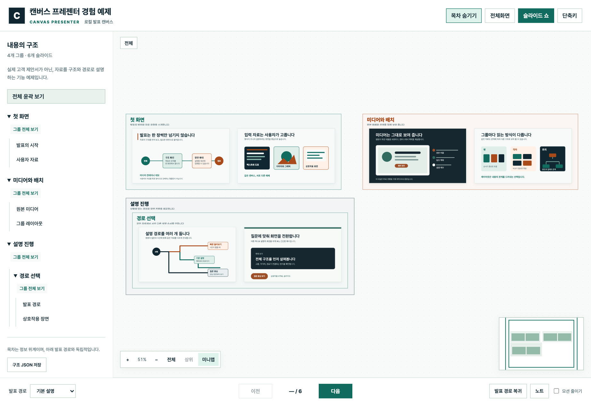

# Canvas Presenter

이미 만들어 둔 SVG·PNG·HTML 슬라이드를 원본 비율 그대로 두고, 미니맵과 줌·팬이 있는 오프라인 발표 캔버스 하나로 묶습니다. Node.js CLI이자 에이전트 스킬입니다.

> Canvas Presenter packages existing SVG, PNG, and HTML slides into a self-contained, zoomable presentation canvas. Documentation is written in Korean.



## 무엇을 하는가

- 슬라이드 여러 장을 **의존성 없는 HTML 한 개**로 묶습니다. CDN도, 실행 시 네트워크 요청도 없습니다.
- **내용의 포함 관계**, **공간 배치**, **발표 순서**를 서로 독립적으로 정합니다. 셋을 하나로 합치지 않습니다.
- 그룹마다 `row`, `column`, `grid`, `tree`, `free` 배치를 고를 수 있습니다.
- 전체 윤곽에서 그룹으로, 그룹에서 슬라이드로 들어갔다 나옵니다. 자유롭게 탐색해도 발표 커서는 유지됩니다.
- `슬라이드 쇼`는 현재 경로의 슬라이드만 원본 비율로 화면에 채우고, 마우스를 움직이면 레이저 포인터가 따라오며 끌면 강조 상자가 그려집니다.
- HTML 슬라이드는 포스터를 기본으로 보여 주고, 선택한 한 장만 sandbox iframe으로 실행합니다.

## 5분 시작

일반 사용에는 `npm install`이 필요 없습니다. Node.js 20 이상이면 됩니다.

```bash
node scripts/canvas.mjs build assets/examples/grouped.json --out ./demo
node scripts/canvas.mjs serve ./demo --port auto
```

내 슬라이드로 시작하려면 먼저 자료를 훑습니다. 파일마다 원본 크기, 다른 슬라이드가 참조하는지, SVG의 외부 참조를 함께 보고합니다.

```bash
node scripts/canvas.mjs inventory /path/to/slides
```

`blocked`가 붙은 파일이 있으면 그대로 빌드할 수 없습니다. SVG가 로고나 폰트를 외부 파일로 참조하는 경우인데, 브라우저도 `` 안의 SVG에서 외부 자원을 차단하므로 통과시켜도 그림이 비어 보입니다. 원본은 두고 작업 사본을 만듭니다.

```bash
node scripts/canvas.mjs inline /path/to/slides --out /path/to/work
```

그다음 [구조 JSON](references/schema.md)을 작성하고 `validate` → `build` 합니다.

## CLI

```text
canvas-presenter inventory INPUT_DIR
canvas-presenter inline    INPUT_DIR --out DIRECTORY [--force]
canvas-presenter validate  MANIFEST
canvas-presenter build     MANIFEST  --out DIRECTORY [--force]
canvas-presenter serve     DIRECTORY [--port 4500|auto]
```

clone한 상태에서는 `canvas-presenter` 대신 `node scripts/canvas.mjs`를 씁니다.

`--force`는 **이 도구가 만든 폴더만** 교체합니다. `build`는 자기 출력 파일 다섯 개, `inline`은 마커에 기록해 둔 파일 목록만 자기 것으로 인정하고, 그 밖의 파일이 하나라도 있으면 삭제하지 않고 멈춥니다.

## 조작

키보드 단축키 전체 표와 슬라이드 쇼·레이저·강조 상자의 동작은 [구조 JSON 계약](references/schema.md)에 있습니다. 화면에서는 `?` 또는 `단축키` 버튼으로 같은 목록을 볼 수 있습니다.

## 보안 경계

생성기는 경로 이탈과 외부 SVG 참조를 거부하고, 결과 HTML에 제한적인 CSP를 적용하며, HTML 슬라이드를 `allow-same-origin` 없는 sandbox iframe에서 실행합니다.

**이것은 악성 코드를 안전하게 다루는 격리 환경이 아닙니다.** 신뢰 경계와 전제는 [SECURITY.md](SECURITY.md)에 있으니 검토하지 않은 HTML을 넣기 전에 반드시 읽으세요.

## 문서

| 읽는 사람 | 문서 |
|---|---|
| 처음 쓰는 사람 | 이 문서 |
| 에이전트 | [SKILL.md](SKILL.md) — 자료를 받아 발표 캔버스를 만드는 절차 |
| 구조 JSON을 쓰는 사람 | [references/schema.md](references/schema.md) — 필드 계약, 배치, 발표 경로, 단축키, 슬라이드 쇼 동작 |
| 기여자 | [CONTRIBUTING.md](CONTRIBUTING.md) — 개발 루프, 깨뜨리면 안 되는 것, 검사 |
| 검증하는 사람 | [references/qa.md](references/qa.md) — 사람이 밟는 절차와 마지막 실측 기록 |
| 릴리스 담당 | [RELEASING.md](RELEASING.md) |
| 배경이 궁금한 사람 | [references/research.md](references/research.md), [CHANGELOG.md](CHANGELOG.md) |

## 배포

- 저장소: <https://github.com/infograb/canvas-presenter>
- 데모: <https://infograb.github.io/canvas-presenter/>
- 배포 형태: GitHub Release의 버전별 ZIP·tar.gz와 SHA-256 체크섬. 현재 버전은 [CHANGELOG.md](CHANGELOG.md)의 맨 위 항목입니다.
- npm에는 게시하지 않습니다. `package.json`의 `private: true`는 실수로 올리는 일을 막기 위한 설정입니다.

스킬로 설치하려면 릴리스 아카이브를 풀거나 저장소를 스킬 디렉터리 아래에 clone합니다.

```bash
git clone https://github.com/infograb/canvas-presenter.git \
  .agents/skills/canvas-presenter
```

프로젝트 밖에서도 쓰려면 사용자 스킬 경로에서 그 디렉터리를 가리키는 심볼릭 링크를 겁니다. 복사본을 두 벌 만들지 마세요.

```bash
ln -s "$PWD/.agents/skills/canvas-presenter" ~/.agents/skills/canvas-presenter
```

## 지원과 기여

질문과 재현 가능한 오류는 [SUPPORT.md](SUPPORT.md)를 본 뒤 GitHub Issue로 남겨 주세요. 변경을 보내기 전에는 [CONTRIBUTING.md](CONTRIBUTING.md)와 [CODE_OF_CONDUCT.md](CODE_OF_CONDUCT.md)를 읽어 주세요.

## 라이선스

자체 코드는 [MIT License](LICENSE)입니다. 번들된 제3자 코드의 저작권과 라이선스는 [THIRD-PARTY-NOTICES.txt](assets/runtime/THIRD-PARTY-NOTICES.txt)에 보존합니다.
